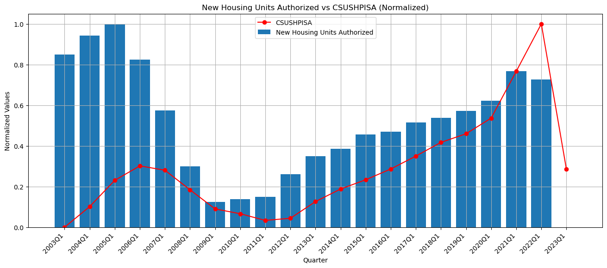

```python
import numpy as np
import pandas as pd
from matplotlib import pyplot as plt
import seaborn as sns
from sklearn.model_selection import train_test_split, cross_val_score
from sklearn.linear_model import LinearRegression
from sklearn.tree import DecisionTreeRegressor
from sklearn.ensemble import RandomForestRegressor
```


```python
supply_data = pd.read_csv("supply.csv")
demand_data = pd.read_csv("demand.csv")
```


```python
supply_data.head()
```


<div>
<style scoped>
    .dataframe tbody tr th:only-of-type {
        vertical-align: middle;
    }

    .dataframe tbody tr th {
        vertical-align: top;
    }

    .dataframe thead th {
        text-align: right;
    }
</style>
<table border="1" class="dataframe">
  <thead>
    <tr style="text-align: right;">
      <th></th>
      <th>DATE</th>
      <th>CSUSHPISA</th>
      <th>MSACSR</th>
      <th>PERMIT</th>
      <th>TLRESCONS</th>
      <th>EVACANTUSQ176N</th>
    </tr>
  </thead>
  <tbody>
    <tr>
      <th>0</th>
      <td>01-01-2003</td>
      <td>129.321</td>
      <td>4.2</td>
      <td>1806.333333</td>
      <td>421328.6667</td>
      <td>14908</td>
    </tr>
    <tr>
      <th>1</th>
      <td>01-04-2003</td>
      <td>131.756</td>
      <td>3.833333333</td>
      <td>1837.666667</td>
      <td>429308.6667</td>
      <td>15244</td>
    </tr>
    <tr>
      <th>2</th>
      <td>01-07-2003</td>
      <td>135.013</td>
      <td>3.633333333</td>
      <td>1937.333333</td>
      <td>458890</td>
      <td>15614</td>
    </tr>
    <tr>
      <th>3</th>
      <td>01-10-2003</td>
      <td>138.8356667</td>
      <td>3.966666667</td>
      <td>1972.333333</td>
      <td>491437.3333</td>
      <td>15654</td>
    </tr>
    <tr>
      <th>4</th>
      <td>01-01-2004</td>
      <td>143.2986667</td>
      <td>3.7</td>
      <td>1994.666667</td>
      <td>506856.3333</td>
      <td>15895</td>
    </tr>
  </tbody>
</table>
</div>


```python
demand_data.head()
```


<div>
<style scoped>
    .dataframe tbody tr th:only-of-type {
        vertical-align: middle;
    }

    .dataframe tbody tr th {
        vertical-align: top;
    }

    .dataframe thead th {
        text-align: right;
    }
</style>
<table border="1" class="dataframe">
  <thead>
    <tr style="text-align: right;">
      <th></th>
      <th>DATE</th>
      <th>CSUSHPISA</th>
      <th>MORTGAGE30US</th>
      <th>UMCSENT</th>
      <th>INTDSRUSM193N</th>
      <th>MSPUS</th>
      <th>GDP</th>
    </tr>
  </thead>
  <tbody>
    <tr>
      <th>0</th>
      <td>01-01-2003</td>
      <td>129.321000</td>
      <td>5.840769</td>
      <td>79.966667</td>
      <td>2.250000</td>
      <td>186000</td>
      <td>11174.129</td>
    </tr>
    <tr>
      <th>1</th>
      <td>01-04-2003</td>
      <td>131.756000</td>
      <td>5.506923</td>
      <td>89.266667</td>
      <td>2.166667</td>
      <td>191800</td>
      <td>11312.766</td>
    </tr>
    <tr>
      <th>2</th>
      <td>01-07-2003</td>
      <td>135.013000</td>
      <td>6.033846</td>
      <td>89.300000</td>
      <td>2.000000</td>
      <td>191900</td>
      <td>11566.669</td>
    </tr>
    <tr>
      <th>3</th>
      <td>01-10-2003</td>
      <td>138.835667</td>
      <td>5.919286</td>
      <td>91.966667</td>
      <td>2.000000</td>
      <td>198800</td>
      <td>11772.234</td>
    </tr>
    <tr>
      <th>4</th>
      <td>01-01-2004</td>
      <td>143.298667</td>
      <td>5.597500</td>
      <td>98.000000</td>
      <td>2.000000</td>
      <td>212700</td>
      <td>11923.447</td>
    </tr>
  </tbody>
</table>
</div>


```python
supply_data['DATE'] = pd.to_datetime(supply_data['DATE'])
demand_data['DATE'] = pd.to_datetime(demand_data['DATE'])

supply_data = supply_data.sort_values('DATE')
demand_data = demand_data.sort_values('DATE')

merged_data = pd.merge(supply_data, demand_data, on='DATE', suffixes=('_supply', '_demand'))

merged_data.dropna(subset=['MSACSR', 'PERMIT', 'TLRESCONS', 'EVACANTUSQ176N', 'MORTGAGE30US', 'GDP', 'UMCSENT'], inplace=True)

merged_data = merged_data.reset_index(drop=True)
```


```python
merged_data.drop('CSUSHPISA_supply', axis=1, inplace=True)

merged_data.rename(columns={'CSUSHPISA_demand': 'CSUSHPISA'}, inplace=True)
merged_data['CSUSHPISA'] = merged_data['CSUSHPISA'].fillna(merged_data['CSUSHPISA'].mean())
merged_data['INTDSRUSM193N'] = merged_data['INTDSRUSM193N'].fillna(merged_data['INTDSRUSM193N'].mean())
```

# Exploratory Data Analysis

## Correlation Matrix: This shows influence of HPI with other factors (positive or negative and intensity)


```python
correlation = merged_data.corr()['CSUSHPISA']
correlation_table = pd.DataFrame(correlation).reset_index()
correlation_table.columns = ['Factors', 'Correlation with CSUSHPISA']
print(correlation_table)
```

             Factors  Correlation with CSUSHPISA
    0      CSUSHPISA                    1.000000
    1   MORTGAGE30US                   -0.215379
    2        UMCSENT                   -0.096213
    3  INTDSRUSM193N                    0.102608
    4          MSPUS                    0.907924
    5            GDP                    0.823877
    

    C:\Users\hp\AppData\Local\Temp\ipykernel_8580\2223458447.py:1: FutureWarning: The default value of numeric_only in DataFrame.corr is deprecated. In a future version, it will default to False. Select only valid columns or specify the value of numeric_only to silence this warning.
      correlation = merged_data.corr()['CSUSHPISA']
    


```python
merged_data['DATE'] = pd.to_datetime(merged_data['DATE'])
merged_data.set_index('DATE', inplace=True)

merged_data['MSACSR'] = pd.to_numeric(merged_data['MSACSR'], errors='coerce')
merged_data['PERMIT'] = pd.to_numeric(merged_data['PERMIT'], errors='coerce')
merged_data['TLRESCONS'] = pd.to_numeric(merged_data['TLRESCONS'], errors='coerce')
merged_data['EVACANTUSQ176N'] = pd.to_numeric(merged_data['EVACANTUSQ176N'], errors='coerce')
```

# Visualization Analysis:


```python
from sklearn.preprocessing import MinMaxScaler
```


```python
# merged_data['DATE'] = pd.to_datetime(merged_data['DATE'])
# merged_data.set_index('DATE', inplace=True)


merged_data['QUARTER'] = merged_data.index.to_period('Q')
merged_data['QUARTER'] = merged_data['QUARTER'].astype(str)


grouped_data = merged_data.groupby('QUARTER').agg({'MSACSR': 'sum', 'CSUSHPISA': 'mean'}).reset_index()

scaler = MinMaxScaler()
grouped_data[['MSACSR', 'CSUSHPISA']] = scaler.fit_transform(grouped_data[['MSACSR', 'CSUSHPISA']])

grouped_data = grouped_data.sort_values('QUARTER')


plt.figure(figsize=(16, 6))  # Adjust the figure size as per your preference

bar_width = 0.4
opacity = 0.8


plt.bar(grouped_data['QUARTER'], grouped_data['MSACSR'], width=bar_width, alpha=opacity, color='skyblue', label='MSACSR')


plt.plot(grouped_data['QUARTER'], grouped_data['CSUSHPISA'], marker='o', linestyle='-', color='red', label='CSUSHPISA')

plt.title('MSACSR vs CSUSHPISA (Normalized)')
plt.xlabel('Quarter')
plt.ylabel('Normalized Values')
plt.legend()

plt.grid(True) 
plt.xticks(rotation=45, ha='right', fontsize=12)  # Rotate and align x-axis tick labels for better readability

plt.tight_layout()
plt.show()
```


    

    


```python
merged_data['QUARTER'] = merged_data.index.to_period('Q')
merged_data['QUARTER'] = merged_data['QUARTER'].astype(str)  # Convert 'QUARTER' values to strings

# Group the data by quarter and calculate the sum of EVACANTUSQ176N and the average of CSUSHPISA for each quarter
grouped_data = merged_data.groupby('QUARTER').agg({'EVACANTUSQ176N': 'sum', 'CSUSHPISA': 'mean'}).reset_index()

# Normalize the data using min-max scaling
scaler = MinMaxScaler()
grouped_data[['EVACANTUSQ176N', 'CSUSHPISA']] = scaler.fit_transform(grouped_data[['EVACANTUSQ176N', 'CSUSHPISA']])

# Sort the data by quarter
grouped_data = grouped_data.sort_values('QUARTER')

# Plotting the bar chart
plt.figure(figsize=(16, 6))  # Adjust the figure size as per your preference

plt.bar(grouped_data['QUARTER'], grouped_data['EVACANTUSQ176N'], label='Vacant Housing Units')
plt.plot(grouped_data['QUARTER'], grouped_data['CSUSHPISA'], marker='o', linestyle='-', color='r', label='CSUSHPISA')

plt.title('Vacant Housing Units vs CSUSHPISA (Normalized)')
plt.xlabel('Quarter')
plt.ylabel('Normalized Values')
plt.legend()

plt.grid(True)  # Add gridlines
plt.xticks(rotation=45, ha='right')  # Rotate and align x-axis tick labels for better readability
plt.show()
```


    

    


```python
merged_data['QUARTER'] = merged_data.index.to_period('Q')
merged_data['QUARTER'] = merged_data['QUARTER'].astype(str)  # Convert 'QUARTER' values to strings

# Group the data by quarter and calculate the sum of PERMIT and the average of CSUSHPISA for each quarter
grouped_data = merged_data.groupby('QUARTER').agg({'PERMIT': 'sum', 'CSUSHPISA': 'mean'}).reset_index()

# Normalize the data using min-max scaling
scaler = MinMaxScaler()
grouped_data[['PERMIT', 'CSUSHPISA']] = scaler.fit_transform(grouped_data[['PERMIT', 'CSUSHPISA']])

# Sort the data by quarter
grouped_data = grouped_data.sort_values('QUARTER')

# Plotting the bar chart
plt.figure(figsize=(16, 6))  # Adjust the figure size as per your preference

plt.bar(grouped_data['QUARTER'], grouped_data['PERMIT'], label='New Housing Units Authorized')
plt.plot(grouped_data['QUARTER'], grouped_data['CSUSHPISA'], marker='o', linestyle='-', color='r', label='CSUSHPISA')

plt.title('New Housing Units Authorized vs CSUSHPISA (Normalized)')
plt.xlabel('Quarter')
plt.ylabel('Normalized Values')
plt.legend()

plt.grid(True)  # Add gridlines
plt.xticks(rotation=45, ha='right')  # Rotate and align x-axis tick labels for better readability

plt.show()
```


    

    


```python
merged_data['QUARTER'] = merged_data.index.to_period('Q')
merged_data['QUARTER'] = merged_data['QUARTER'].astype(str)  # Convert 'QUARTER' values to strings

# Group the data by quarter and calculate the sum of TLRESCONS and the average of CSUSHPISA for each quarter
grouped_data = merged_data.groupby('QUARTER').agg({'TLRESCONS': 'sum', 'CSUSHPISA': 'mean'}).reset_index()

# Normalize the data using min-max scaling
scaler = MinMaxScaler()
grouped_data[['TLRESCONS', 'CSUSHPISA']] = scaler.fit_transform(grouped_data[['TLRESCONS', 'CSUSHPISA']])

# Sort the data by quarter
grouped_data = grouped_data.sort_values('QUARTER')

# Plotting the bar chart
plt.figure(figsize=(16, 6))  # Adjust the figure size as per your preference

bar_width = 0.4
opacity = 0.8

# Bar chart for TLRESCONS (New Housing Units Authorized)
plt.bar(grouped_data['QUARTER'], grouped_data['TLRESCONS'], width=bar_width, alpha=opacity, color='skyblue', label='Total Construction Spending')

# Line plot for CSUSHPISA
plt.plot(grouped_data['QUARTER'], grouped_data['CSUSHPISA'], marker='o', linestyle='-', color='red', label='CSUSHPISA')

plt.title('Total Construction Spending vs CSUSHPISA (Normalized)')
plt.xlabel('Quarter')
plt.ylabel('Normalized Values')
plt.legend()

plt.grid(True)  # Add gridlines
plt.xticks(rotation=45, ha='right', fontsize=12)  # Rotate and align x-axis tick labels for better readability

plt.tight_layout()  # Ensure all elements fit into the figure area
plt.show()
```


    

    


```python
merged_data['QUARTER'] = merged_data.index.to_period('Q')
merged_data['QUARTER'] = merged_data['QUARTER'].astype(str)  # Convert 'QUARTER' values to strings

# Group the data by quarter and calculate the sum of MORTGAGE30US and the average of CSUSHPISA for each quarter
grouped_data = merged_data.groupby('QUARTER').agg({'MORTGAGE30US': 'sum', 'CSUSHPISA': 'mean'}).reset_index()

# Normalize the data using min-max scaling
scaler = MinMaxScaler()
grouped_data[['MORTGAGE30US', 'CSUSHPISA']] = scaler.fit_transform(grouped_data[['MORTGAGE30US', 'CSUSHPISA']])

# Sort the data by quarter
grouped_data = grouped_data.sort_values('QUARTER')

# Plotting the bar chart
plt.figure(figsize=(16, 6))  # Adjust the figure size as per your preference

bar_width = 0.4
opacity = 0.8

# Bar chart for MORTGAGE30US
plt.bar(grouped_data['QUARTER'], grouped_data['MORTGAGE30US'], width=bar_width, alpha=opacity, color='skyblue', label='30-Year Fixed Rate Mortgage')

# Line plot for CSUSHPISA
plt.plot(grouped_data['QUARTER'], grouped_data['CSUSHPISA'], marker='o', linestyle='-', color='red', label='CSUSHPISA')

plt.title('30-Year Fixed Rate Mortgage vs CSUSHPISA (Normalized)')
plt.xlabel('Quarter')
plt.ylabel('Normalized Values')
plt.legend()

plt.grid(True)  # Add gridlines
plt.xticks(rotation=45, ha='right', fontsize=12)  # Rotate and align x-axis tick labels for better readability

plt.tight_layout()  # Ensure all elements fit into the figure area
plt.show()
```


    

    


```python
merged_data['QUARTER'] = merged_data.index.to_period('Q')
merged_data['QUARTER'] = merged_data['QUARTER'].astype(str)  # Convert 'QUARTER' values to strings

# Group the data by quarter and calculate the sum of GFDEGDQ188S and the average of CSUSHPISA for each quarter
grouped_data = merged_data.groupby('QUARTER').agg({'GDP': 'sum', 'CSUSHPISA': 'mean'}).reset_index()

# Normalize the data using min-max scaling
scaler = MinMaxScaler()
grouped_data[['GDP', 'CSUSHPISA']] = scaler.fit_transform(grouped_data[['GDP', 'CSUSHPISA']])

# Sort the data by quarter
grouped_data = grouped_data.sort_values('QUARTER')

# Plotting the bar chart
plt.figure(figsize=(16, 6))  # Adjust the figure size as per your preference

bar_width = 0.4
opacity = 0.8

# Bar chart for GFDEGDQ188S
plt.bar(grouped_data['QUARTER'], grouped_data['GDP'], width=bar_width, alpha=opacity, color='skyblue', label='Federal Debt')

# Line plot for CSUSHPISA
plt.plot(grouped_data['QUARTER'], grouped_data['CSUSHPISA'], marker='o', linestyle='-', color='red', label='CSUSHPISA')

plt.title('GDP vs CSUSHPISA (Normalized)')
plt.xlabel('Quarter')
plt.ylabel('Normalized Values')
plt.legend()

plt.grid(True)  # Add gridlines
plt.xticks(rotation=45, ha='right', fontsize=8)  # Rotate and align x-axis tick labels for better readability

plt.tight_layout()  # Ensure all elements fit into the figure area
plt.show()
```


    

    


```python
merged_data['QUARTER'] = merged_data.index.to_period('Q')
merged_data['QUARTER'] = merged_data['QUARTER'].astype(str)  # Convert 'QUARTER' values to strings

# Group the data by quarter and calculate the sum of UMCSENT and the average of CSUSHPISA for each quarter
grouped_data = merged_data.groupby('QUARTER').agg({'UMCSENT': 'sum', 'CSUSHPISA': 'mean'}).reset_index()

# Normalize the data using min-max scaling
scaler = MinMaxScaler()
grouped_data[['UMCSENT', 'CSUSHPISA']] = scaler.fit_transform(grouped_data[['UMCSENT', 'CSUSHPISA']])

# Sort the data by quarter
grouped_data = grouped_data.sort_values('QUARTER')

# Plotting the bar chart
plt.figure(figsize=(16, 6))  # Adjust the figure size as per your preference

bar_width = 0.4
opacity = 0.8

# Bar chart for UMCSENT
plt.bar(grouped_data['QUARTER'], grouped_data['UMCSENT'], width=bar_width, alpha=opacity, color='skyblue', label='Consumer Sentiment')

# Line plot for CSUSHPISA
plt.plot(grouped_data['QUARTER'], grouped_data['CSUSHPISA'], marker='o', linestyle='-', color='red', label='CSUSHPISA')

plt.title('Consumer Sentiment vs CSUSHPISA (Normalized)')
plt.xlabel('Quarter')
plt.ylabel('Normalized Values')
plt.legend()

plt.grid(True)  # Add gridlines
plt.xticks(rotation=45, ha='right', fontsize=8)  # Rotate and align x-axis tick labels for better readability

plt.tight_layout()  # Ensure all elements fit into the figure area
plt.show()
```


    

    


```python
merged_data['QUARTER'] = merged_data.index.to_period('Q')
merged_data['QUARTER'] = merged_data['QUARTER'].astype(str)  # Convert 'QUARTER' values to strings

# Group the data by quarter and calculate the sum of INTDSRUSM193N and the average of CSUSHPISA for each quarter
grouped_data = merged_data.groupby('QUARTER').agg({'INTDSRUSM193N': 'sum', 'CSUSHPISA': 'mean'}).reset_index()

# Normalize the data using min-max scaling
scaler = MinMaxScaler()
grouped_data[['INTDSRUSM193N', 'CSUSHPISA']] = scaler.fit_transform(grouped_data[['INTDSRUSM193N', 'CSUSHPISA']])

# Sort the data by quarter
grouped_data = grouped_data.sort_values('QUARTER')

# Plotting the bar chart
plt.figure(figsize=(16, 6))  # Adjust the figure size as per your preference

bar_width = 0.4
opacity = 0.8

# Bar chart for INTDSRUSM193N
plt.bar(grouped_data['QUARTER'], grouped_data['INTDSRUSM193N'], width=bar_width, alpha=opacity, color='skyblue', label='Interest Rates')

# Line plot for CSUSHPISA
plt.plot(grouped_data['QUARTER'], grouped_data['CSUSHPISA'], marker='o', linestyle='-', color='red', label='CSUSHPISA')

plt.title('Interest Rates vs CSUSHPISA (Normalized)')
plt.xlabel('Quarter')
plt.ylabel('Normalized Values')
plt.legend()

plt.grid(True)  # Add gridlines
plt.xticks(rotation=45, ha='right', fontsize=8)  # Rotate and align x-axis tick labels for better readability

plt.tight_layout()  # Ensure all elements fit into the figure area
plt.show()
```


    

    


```python
merged_data['QUARTER'] = merged_data.index.to_period('Q')
merged_data['QUARTER'] = merged_data['QUARTER'].astype(str)  # Convert 'QUARTER' values to strings

# Group the data by quarter and calculate the sum of MSPUS and the average of CSUSHPISA for each quarter
grouped_data = merged_data.groupby('QUARTER').agg({'MSPUS': 'sum', 'CSUSHPISA': 'mean'}).reset_index()

# Normalize the data using min-max scaling
scaler = MinMaxScaler()
grouped_data[['MSPUS', 'CSUSHPISA']] = scaler.fit_transform(grouped_data[['MSPUS', 'CSUSHPISA']])

# Sort the data by quarter
grouped_data = grouped_data.sort_values('QUARTER')

# Plotting the bar chart
plt.figure(figsize=(16, 6))  # Adjust the figure size as per your preference

bar_width = 0.4
opacity = 0.8

# Bar chart for MSPUS
plt.bar(grouped_data['QUARTER'], grouped_data['MSPUS'], width=bar_width, alpha=opacity, color='skyblue', label='Median Sales Price')

# Line plot for CSUSHPISA
plt.plot(grouped_data['QUARTER'], grouped_data['CSUSHPISA'], marker='o', linestyle='-', color='red', label='CSUSHPISA')

plt.title('Median Sales Price vs CSUSHPISA (Normalized)')
plt.xlabel('Quarter')
plt.ylabel('Normalized Values')
plt.legend()

plt.grid(True)  # Add gridlines
plt.xticks(rotation=45, ha='right', fontsize=8)  # Rotate and align x-axis tick labels for better readability

plt.tight_layout()  # Ensure all elements fit into the figure area
plt.show()
```


    

    


```python
from sklearn.metrics import mean_squared_error
```

# Model Building


```python
features = ['MSACSR', 'PERMIT', 'TLRESCONS', 'EVACANTUSQ176N', 'MORTGAGE30US', 'GDP', 'UMCSENT', 'INTDSRUSM193N', 'MSPUS']
target = 'CSUSHPISA'

X_train, X_test, y_train, y_test = train_test_split(merged_data[features], merged_data[target], test_size=0.2, random_state=42)

models = {
    'Linear Regression': LinearRegression(),
    'Decision Tree': DecisionTreeRegressor(),
    'Random Forest': RandomForestRegressor()
}

results = {}
for model_name, model in models.items():
    scores = cross_val_score(model, X_train, y_train, cv=3, scoring='neg_mean_squared_error')
    mse_scores = -scores
    avg_mse = mse_scores.mean()
    results[model_name] = avg_mse


best_model = min(results, key=results.get)
best_model_instance = models[best_model]


best_model_instance.fit(X_train, y_train)


predictions = best_model_instance.predict(X_test)
mse = mean_squared_error(y_test, predictions)


print("Model Selection Results:")
for model, mse_score in results.items():
    print(f"{model}: MSE={mse_score}")

print(f"\nBest Model: {best_model}")
print(f"Best Model MSE on Testing Set: {mse}")
```

    Model Selection Results:
    Linear Regression: MSE=487.79125478069335
    Decision Tree: MSE=538.635814494689
    Random Forest: MSE=514.3841213656264
    
    Best Model: Linear Regression
    Best Model MSE on Testing Set: 33.1796348249874
    


```python
from sklearn.metrics import r2_score
r2 = r2_score(y_test, predictions)

print("R-squared score:", r2)
```

    R-squared score: 0.9723281532455835
    


```python
best_model_instance.fit(X_train, y_train)

coefficients = best_model_instance.coef_


print("Coefficients:")
for feature, coefficient in zip(features, coefficients):
    print(f"{feature}: {coefficient}")
```

    Coefficients:
    MSACSR: 8.17930639611561
    PERMIT: 0.019751930454268023
    TLRESCONS: 5.693157163689281e-05
    EVACANTUSQ176N: -0.001330982808884793
    MORTGAGE30US: -14.994935732273591
    GDP: -0.003034615996584728
    UMCSENT: -0.18699748490153925
    INTDSRUSM193N: 3.972030401368267
    MSPUS: 0.00045593039550579056
    

# Interpretation and Insights:
## Supply Factors:
- The S&P/Case-Shiller U.S. Public Home Value File (CSUSHPISA) shows an exceptionally humble positive relationship with the month to month supply of new homes (MSACSR). Since the relationship is so feeble, we can close it is negative (since supply increment). This suggests that an expansion in the stock of new homes might affect lodging costs.
- The relationship between home values and the number of permitted housing units (PERMIT) is moderately positive. As a result, a larger number of permitted housing units may raise property prices. The justification behind this is that when more houses are approved for building, the inventory of houses, materials, and works is affected.
- All out development spending on private ventures (TLRESCONS) has areas of strength for a relationship with home costs. This suggests that higher home prices are strongly linked to higher construction spending. The justification behind this is straightforward: development costs incorporate structure materials, work, and different charges. This raises generally house costs.
- The assessed number of empty lodging units (EVACANTUSQ176N) has a moderate negative relationship with home costs. This recommends that a bigger number of empty lodging units might apply descending strain on home costs. Since houses supply builds prompts decline in home costs.

## Demand Factors:
- There is a moderately negative correlation between home prices and the average interest rate for a 30-year fixed-rate mortgage (MORTGAGE30US). This infers that higher home loan rates are related with somewhat lower home costs. Mortgage rates can rise as a result of a rise in the federal funds rate, and lower demand for homes can result in lower home prices.
- Home prices are negatively correlated with consumer sentiment (UMCSENT). Lower buyer opinion is related with somewhat lower home costs. At the point when customers are sure about the economy, they are bound to burn through cash on expensive things, for example, homes which can drive up home costs.
- According to the data, there is a scaling or trailing issue because interest rates or discount rates (INTDSRUSM193N) have a weak positive association with home prices. There is a negative relationship between house prices and interest rates. Home prices fall as a result of lower interest rates.
- There is a strong positive correlation between GDP and home prices. Higher Gross domestic product is unequivocally connected with higher home costs.
- The median deals cost of houses sold (MSPUS) has areas of strength for a connection with home costs. Home prices are strongly linked to higher median sales prices.


```python

```
